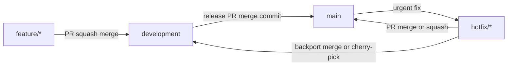

# Contributing to Civ 6 Strategic Planner

Thank you for your interest in contributing to the Civ 6 Strategic Planner! This document provides guidelines and instructions for contributing to the project.

## Table of Contents

- [Development Environment Setup](#development-environment-setup)
- [Project Structure](#project-structure)
- [Code Style Guidelines](#code-style-guidelines)
- [Git Workflow](#git-workflow)
- [Pull Request Process](#pull-request-process)
- [Testing](#testing)
- [Issue Reporting](#issue-reporting)

## Development Environment Setup

### Prerequisites

- **Node.js 20.19+**: Download from [nodejs.org](https://nodejs.org/)
- **npm** (comes with Node.js) or **yarn**
- **Git**: For version control
- A code editor (we recommend VS Code with the ESLint and Prettier extensions)

### Getting Started

1. **Clone the repository**

   ```bash
   git clone https://github.com/your-username/civ6-planner.git
   cd civ6-planner
   ```

2. **Install dependencies**

   ```bash
   npm install
   ```

3. **Start the development server**

   ```bash
   npm start
   ```

   This launches the Electron app with hot-reload enabled. The app will automatically refresh when you make changes to the renderer code.

4. **Run the linter**

   ```bash
   npm run lint
   ```

5. **Run the typecheck**

   ```bash
   npm run typecheck
   ```

6. **Check formatting**

   ```bash
   npm run format:check
   ```

7. **Run tests**

   ```bash
   npm test
   ```

### Building for Production

```bash
# Package the app for your current platform
npm run package

# Create distributable installers
npm run make
```

## Project Structure

```
src/
├── main/                 # Electron main process
│   ├── main.ts          # Window management, IPC handlers, file I/O
│   └── preload.ts       # Secure bridge to renderer (contextBridge)
├── renderer/            # React frontend (renderer process)
│   ├── components/      # React components
│   │   ├── GameSetup.tsx      # Initial game configuration
│   │   ├── GameView.tsx       # Main game interface
│   │   ├── HexGrid.tsx        # SVG hex map with pan/zoom
│   │   └── TileInspector.tsx  # Tile editing sidebar
│   ├── data/            # Static data (civilizations, etc.)
│   ├── styles/          # Global CSS styles
│   ├── utils/           # Utility functions
│   │   ├── hexUtils.ts        # Hex coordinate math
│   │   └── persistence.ts     # Serialization helpers
│   ├── store.ts         # Zustand state management
│   └── App.tsx          # Root component
└── types/               # TypeScript type definitions
    ├── model.ts         # Core domain types
    ├── store.ts         # Store interface (for main process)
    └── persistence.ts   # Persistence helpers (main process)
```

## Code Style Guidelines

### TypeScript

- **Use strict TypeScript**: All code should be properly typed. Avoid `any` unless absolutely necessary.
- **Prefer interfaces over type aliases** for object shapes, use `type` for unions and primitives.
- **Use string literal unions** instead of enums for better JSON serialization:

  ```typescript
  // Preferred
  type Terrain = "grassland" | "plains" | "desert";

  // Avoid
  enum Terrain {
    Grassland,
    Plains,
    Desert,
  }
  ```

- **Export types explicitly**: Group related types together with clear section comments.

### React Components

- **Use functional components** with hooks (no class components).
- **Props interfaces**: Define a `Props` interface for each component:

  ```typescript
  interface MyComponentProps {
    value: string;
    onChange: (value: string) => void;
  }

  const MyComponent: React.FC<MyComponentProps> = ({ value, onChange }) => {
    // ...
  };
  ```

- **Use `useState` and `useEffect`** appropriately. Memoize callbacks with `useCallback` when passed to child components.
- **Keep components focused**: If a component exceeds ~200 lines, consider splitting it.

### State Management (Zustand)

- **Immutable updates**: Always return new objects/arrays, never mutate state directly:

  ```typescript
  // Correct
  set((state) => ({
    items: [...state.items, newItem],
  }));

  // Wrong
  set((state) => {
    state.items.push(newItem); // Don't mutate!
    return state;
  });
  ```

- **Action naming**: Use verb prefixes that describe the action: `addTile`, `updateCity`, `removeTilePlan`.

### CSS

- **Component-scoped CSS**: Each component has its own `.css` file.
- **Use CSS custom properties** (variables) defined in `global.css` for theming.
- **BEM-like naming**: Use descriptive class names like `.tile-inspector`, `.inspector-header`.

### Documentation

- **JSDoc comments**: Add JSDoc to exported functions, interfaces, and complex components.
- **Inline comments**: Explain "why" rather than "what" when the code isn't self-explanatory.

## Git Workflow

### Branching Strategy

We use a 2-branch flow:

- **`main`**: Production/release branch. Only receives merges from `development` (release PRs) or hotfix branches.
- **`development`**: Default integration branch. All feature work is merged here first.
- `feature/*`: New features branched from `development` (e.g., `feature/build-queue-ui`)
- `fix/*`: Bug fixes branched from `development` (e.g., `fix/tile-selection-bug`)
- `chore/*`: Maintenance tasks branched from `development` (e.g., `chore/update-dependencies`)
- `docs/*`: Documentation updates branched from `development` (e.g., `docs/api-documentation`)
- `hotfix/*`: Urgent production fixes branched from `main` (e.g., `hotfix/critical-save-bug`)



### Commit Messages

Follow conventional commit format. PR titles must also follow this format because we squash-merge.

```
<type>(<scope>): <description>

[optional body]
```

**Types:**

- `feat`: New feature
- `fix`: Bug fix
- `docs`: Documentation changes
- `style`: Code style (formatting, no logic change)
- `refactor`: Code refactoring
- `test`: Adding or updating tests
- `chore`: Maintenance tasks

**Examples:**

```
feat(hex-grid): add zoom-to-fit button
fix(tile-inspector): prevent form reset on feature toggle
docs(readme): update installation instructions
refactor(store): extract tile actions into separate file
```

### Git Hooks

We use Husky + lint-staged locally to catch issues early:

- **Pre-commit**: runs Prettier on staged files and ESLint on staged `*.ts`/`*.tsx` (fast; does **not** run `typecheck`)
- **Pre-push**: runs `npm run typecheck` and `npm test` to catch CI failures before you push
- **Commit-msg**: validates Conventional Commits

Hooks are installed automatically after `npm install` via the `prepare` script. If hooks aren't running, execute:

```bash
npm run prepare
```

To temporarily skip hooks for a single command:

```bash
HUSKY=0 git commit -m "chore: skip hooks"
```

## Pull Request Process

1. **Create a feature branch** from `development`:

   ```bash
   git checkout development
   git pull origin development
   git checkout -b feature/my-feature
   ```

2. **Make your changes** following the code style guidelines.

3. **Run the linter** and fix any issues:

   ```bash
   npm run lint
   ```

4. **Test your changes** manually in the app.

5. **Commit your changes** with descriptive commit messages.

6. **Push your branch** and create a pull request targeting `development`:

   ```bash
   git push -u origin feature/my-feature
   ```

7. **Ensure the PR title follows Conventional Commits** (used for the squash-merge commit).

8. **Fill out the PR template** with:
   - Summary of changes
   - Related issues (if any)
   - Testing steps
   - Screenshots (for UI changes)

9. **Address review feedback** by pushing additional commits.

10. **Squash and merge** once approved (for feature PRs into `development`).

### Merge Strategies

- **Feature PRs → `development`**: Use **squash and merge**. The PR title becomes the commit message, so it must follow Conventional Commits.
- **Release PRs (`development` → `main`)**: Use a **merge commit** (not squash) so `release-please` can see all the individual Conventional Commits and generate an accurate changelog.
- **Hotfix PRs → `main`**: Use **squash and merge** or **merge commit** depending on the number of commits.

### Hotfix Flow

For urgent production fixes that cannot wait for a normal release cycle:

1. **Branch from `main`**:

   ```bash
   git checkout main
   git pull origin main
   git checkout -b hotfix/critical-bug-description
   ```

2. **Make the fix** and test thoroughly.

3. **Create a PR targeting `main`**. Once approved and merged, `release-please` will include it in the next release.

4. **Backport to `development`** to prevent branch divergence:

   ```bash
   git checkout development
   git pull origin development
   git merge main
   # Or cherry-pick specific commits if preferred
   git push origin development
   ```

### PR Checklist

- [ ] Code follows the style guidelines
- [ ] Self-reviewed the code
- [ ] Added/updated JSDoc comments where appropriate
- [ ] Formatting passes (`npm run format:check`)
- [ ] Linter passes (`npm run lint`)
- [ ] Typecheck passes (`npm run typecheck`)
- [ ] Tests pass (`npm test`)
- [ ] Tested manually in the app
- [ ] Updated documentation if needed

### Branch Protection (Recommended)

Protect both `main` and `development` branches in GitHub settings:

**`development` branch:**

- Require pull request before merging
- Required status checks:
  - PR title lint (Conventional Commits)
  - `npm run format:check`
  - `npm run lint`
  - `npm run typecheck`
  - `npm test`
  - `npm run package`

**`main` branch:**

- Require pull request before merging
- Required status checks: same as `development`
- Restrict who can push (only maintainers via release PRs or hotfixes)
- Consider: require linear history

**GitHub repo settings:**

- Set **default branch** to `development` so PRs naturally target it
- Policy: only merge to `main` via release PRs from `development` or hotfix PRs

## Testing

### Manual Testing

Currently, the project relies on manual testing. When testing your changes:

1. **Test the happy path**: Verify the feature works as expected.
2. **Test edge cases**: Empty states, maximum values, invalid inputs.
3. **Test persistence**: Ensure data survives app restart (auto-save functionality).

### Future Testing Plans

We have basic unit tests (Vitest) for renderer utilities. Add new tests alongside the code (e.g. `src/**/**.test.ts`) and run:

```bash
npm test
```

We plan to add:

- More unit tests for utilities and reducers
- Component tests for React components
- E2E tests for critical user flows

Contributions to the test infrastructure are welcome!

## Issue Reporting

### Bug Reports

When reporting a bug, please include:

1. **Description**: Clear description of the bug
2. **Steps to reproduce**: Numbered steps to trigger the bug
3. **Expected behavior**: What should happen
4. **Actual behavior**: What actually happens
5. **Environment**: OS, Node.js version, app version
6. **Screenshots**: If applicable

### Feature Requests

When requesting a feature:

1. **Problem statement**: What problem does this solve?
2. **Proposed solution**: How should it work?
3. **Alternatives considered**: Other approaches you thought of
4. **Additional context**: Mockups, examples, or references

## Questions?

If you have questions about contributing, feel free to:

- Open a GitHub Discussion
- Comment on a relevant issue
- Reach out to the maintainers

Thank you for contributing!
