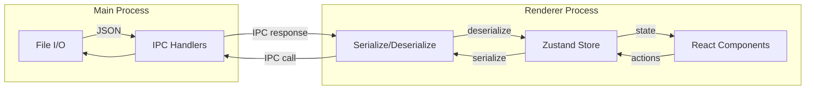

# Architecture Documentation

This document describes the architecture, design patterns, and key technical decisions for the Civ 6 Strategic Planner.

## Overview

The Civ 6 Strategic Planner is an Electron desktop application that uses React for the UI, Zustand for state management, and TypeScript for type safety. It follows a standard Electron multi-process architecture with clear separation between the main (Node.js) and renderer (browser) processes.

## Process Architecture

### Main Process

Located in `src/main/main.ts`, the main process handles:

- **Window Management**: Creates and manages the BrowserWindow instance
- **File I/O**: Reads and writes save files to the local file system
- **IPC Handlers**: Responds to inter-process communication requests from the renderer
- **Application Lifecycle**: Manages app startup, shutdown, and platform-specific behaviors

Key responsibilities:
- Creating the application window with appropriate security settings
- Exposing a secure API via the preload script
- Persisting game state to JSON files
- Creating backups of save files

### Preload Script

Located in `src/main/preload.ts`, the preload script:

- Acts as a secure bridge between main and renderer processes
- Exposes a controlled `window.electronAPI` interface
- Uses `contextBridge` to safely expose only necessary functions
- Prevents direct access to Node.js APIs from the renderer

Exposed API:
```typescript
window.electronAPI = {
  saveGame: (data: SerializedGameState) => Promise<void>
  loadGame: () => Promise<SerializedGameState | null>
  backupSave: () => Promise<void>
}
```

### Renderer Process

Located in `src/renderer/`, the renderer process contains the React application:

- **React Components**: UI implementation
- **Zustand Store**: Centralized state management
- **Utilities**: Hex math, persistence helpers, color mapping

The renderer has no direct access to Node.js APIs and communicates with the main process exclusively through the exposed `electronAPI`.

## Data Flow



### Save Flow

1. User performs actions in the UI (add tile, advance turn, etc.)
2. React components call Zustand store actions
3. Store updates state and triggers re-render
4. Auto-save timer triggers save operation
5. Store state is serialized to JSON-compatible format (Maps → Arrays, Sets → Arrays, Dates → ISO strings)
6. Serialized data sent to main process via `window.electronAPI.saveGame()`
7. Main process writes JSON to file system

### Load Flow

1. Application starts or user clicks "Load Game"
2. Renderer requests data via `window.electronAPI.loadGame()`
3. Main process reads JSON file from file system
4. JSON data returned to renderer
5. Data deserialized back to runtime types (Arrays → Maps/Sets, ISO strings → Dates)
6. Store state updated with deserialized data
7. React components re-render with loaded state

## Component Hierarchy

```
App.tsx
├── GameSetup.tsx                    # Initial game configuration
│   └── Civilization selection
│   └── Leader selection
│   └── Victory type & game speed
│   └── DLC toggles
│
└── GameView.tsx                     # Main game interface
    ├── Header
    │   ├── Civ/Leader info
    │   ├── Turn counter (clickable)
    │   └── Stats (cities, tiles)
    │
    ├── HexGrid.tsx                  # SVG hex map
    │   ├── Grid guides (dashed hexes)
    │   ├── Rendered tiles
    │   │   ├── Terrain color
    │   │   ├── Feature overlay
    │   │   ├── District/improvement icon
    │   │   ├── Resource indicator
    │   │   ├── City name
    │   │   └── Lock/plan indicators
    │   └── Pan/zoom controls
    │
    └── TileInspector.tsx            # Sidebar for tile editing
        ├── Terrain selection
        ├── Modifier selection
        ├── Feature checkboxes
        ├── Current state (district/improvement)
        ├── Planned states list
        └── Lock toggle
```

## State Management

The application uses a single Zustand store (`src/renderer/store.ts`) that extends the `GameState` interface with action methods.

### Store Structure

```typescript
interface GameStore extends GameState {
  // State (from GameState)
  setup: GameSetup
  currentTurn: number
  tiles: Map<string, Tile>
  cities: City[]
  completedTechs: Set<string>
  // ... more state

  // Actions
  newGame: (setup: GameSetup) => void
  addTile: (tile: Omit<Tile, ...>) => void
  updateTile: (coord: HexCoord, updates: Partial<Tile>) => void
  addCity: (city: Omit<City, ...>) => void
  advanceTurn: (newTurn: number) => void
  // ... more actions
}
```

### Action Categories

1. **Game Lifecycle**: `newGame()`, `loadState()`, `advanceTurn()`
2. **Tile Management**: `addTile()`, `updateTile()`, `addTilePlan()`, `removeTilePlan()`, `lockTile()`
3. **City Management**: `addCity()`, `updateCity()`, `addToBuildQueue()`, `reorderBuildQueue()`
4. **Research**: `addToTechQueue()`, `completeTech()`, `addToCivicQueue()`, `completeCivic()`
5. **Policies**: `updatePolicies()`
6. **AI Tracking**: `addAICiv()`, `updateAICiv()`, `setThreatLevel()`
7. **Recommendations**: `addRecommendation()`, `dismissRecommendation()`

All actions are immutable operations that return new state objects, triggering efficient React re-renders.

## Key Design Decisions

### Hex Coordinate System

**Decision**: Use axial coordinates (q, r) for hex positioning.

**Rationale**: 
- Simpler math than offset coordinates
- Only 2 values instead of 3 (cube coordinates)
- Direct mapping to pixel coordinates with simple formulas
- Standard approach in hex grid libraries

**Implementation**: `src/renderer/utils/hexUtils.ts` contains conversion functions:
- `hexToPixel(coord)`: Convert hex coords to SVG pixel position
- `pixelToHex(x, y)`: Convert mouse position to hex coords
- `hexCorners(center)`: Generate SVG polygon points for hex shape

### Map Storage

**Decision**: Use `Map<string, Tile>` with coordinate keys instead of nested arrays.

**Rationale**:
- Sparse map support (not all hexes need to exist)
- O(1) lookup by coordinate
- Easy to add/remove individual tiles
- No need to manage array bounds

**Trade-off**: Maps don't serialize to JSON directly, requiring conversion to/from arrays during persistence.

### Timeline-Based Planning

**Decision**: Store multiple planned states per tile with flexible trigger conditions.

**Rationale**:
- Players often plan multiple steps ahead ("place district after Writing, then build library after Philosophy")
- Tech/civic triggers automatically align plans with research progress
- Turn-based triggers help with timing critical decisions
- Manual triggers support exploratory/uncertain plans

**Implementation**: Each `Tile` has a `plannedStates: TilePlannedState[]` array where each entry has:
```typescript
{
  id: string
  trigger: StateTrigger  // When to execute
  action: TileAction     // What to do
  rationale?: string     // User's notes
}
```

### Immutable State Updates

**Decision**: All Zustand actions create new objects/arrays instead of mutating existing state.

**Rationale**:
- Predictable state changes
- Enables React's efficient reconciliation
- Easier debugging (can log/compare state snapshots)
- Matches React best practices

**Pattern**: Use spread operators and array methods:
```typescript
addCity: (city) => set((state) => ({
  cities: [...state.cities, { ...city, id: uuidv4() }]
}))
```

### SVG-Based Rendering

**Decision**: Use raw SVG for the hex grid instead of Canvas or a library like PixiJS.

**Rationale**:
- No external dependencies for rendering
- SVG scales perfectly with zoom
- Built-in event handling per element
- Smaller bundle size
- Easy styling with CSS

**Trade-off**: May have performance issues with 1000+ hexes (not expected for typical use).

### Type Safety

**Decision**: Comprehensive TypeScript types defined in `src/types/model.ts`.

**Rationale**:
- Catch errors at compile time
- Excellent IDE autocomplete
- Self-documenting code
- Easier refactoring

**Approach**: Define all domain types explicitly:
- Use `type` for unions (e.g., `type Terrain = "grassland" | "plains" | ...`)
- Use `interface` for objects
- Use `enum` sparingly (string unions preferred for JSON serialization)

### Persistence Schema Versioning

**Decision**: Include `schemaVersion` field in serialized data.

**Rationale**:
- Future-proof for data model changes
- Can implement migration logic when schema changes
- Helps diagnose compatibility issues

**Implementation**: `CURRENT_SCHEMA_VERSION = 1` constant, checked on load with console warning if mismatch.

## Future Architecture Considerations

### Planned Features

The architecture supports these planned features without major refactoring:

1. **Build Queue Management**: Already modeled in `City.buildQueue`, needs UI implementation
2. **Research Tracking**: Tech/civic queues exist, need Eureka/Inspiration progress tracking UI
3. **Policy Recommendations**: `Recommendation` type exists, needs recommendation generation logic
4. **District Adjacency**: Can calculate from existing `tiles` Map and `cities` data
5. **Conflict Detection**: Can analyze `plannedStates` arrays for conflicts (e.g., two districts planned for same tile)

### Scalability Notes

- Current architecture scales well to ~1000 tiles and ~20 cities (typical game size)
- SVG rendering may need optimization (virtualization, Canvas fallback) for extremely large maps
- Zustand store performs well with current state size; no need for state splitting yet
- File I/O is synchronous but acceptable for current save file sizes (~100KB typical)

### Extension Points

The architecture has clear extension points for adding features:

- **New tile actions**: Add to `TileAction` union type
- **New trigger types**: Add to `StateTrigger` union type
- **Additional game modes**: Extend `GameSetup.dlc` object
- **AI recommendations**: Implement analyzers that read state and write to `recommendations` array
- **Multiplayer planning**: Renderer-side architecture supports multiple game states, would need main process coordination

## Development Workflow

1. **Adding Features**: 
   - Define types in `src/types/model.ts`
   - Add store actions in `src/renderer/store.ts`
   - Implement UI in `src/renderer/components/`
   - Update persistence if schema changes

2. **Debugging**:
   - React DevTools for component inspection
   - Zustand DevTools for state debugging
   - Electron DevTools for IPC monitoring

3. **Testing Strategy** (to be implemented):
   - Unit tests for hex math utilities
   - Unit tests for serialization/deserialization
   - Component tests for React components
   - E2E tests for critical user flows

## Additional Documentation

- [README.md](../README.md): Setup, usage, and feature overview
- [src/types/model.ts](../src/types/model.ts): Complete type definitions with inline documentation
- [src/renderer/store.ts](../src/renderer/store.ts): State management implementation
